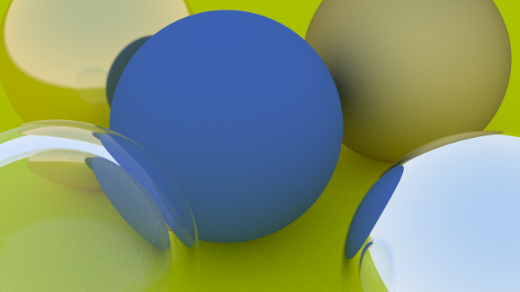
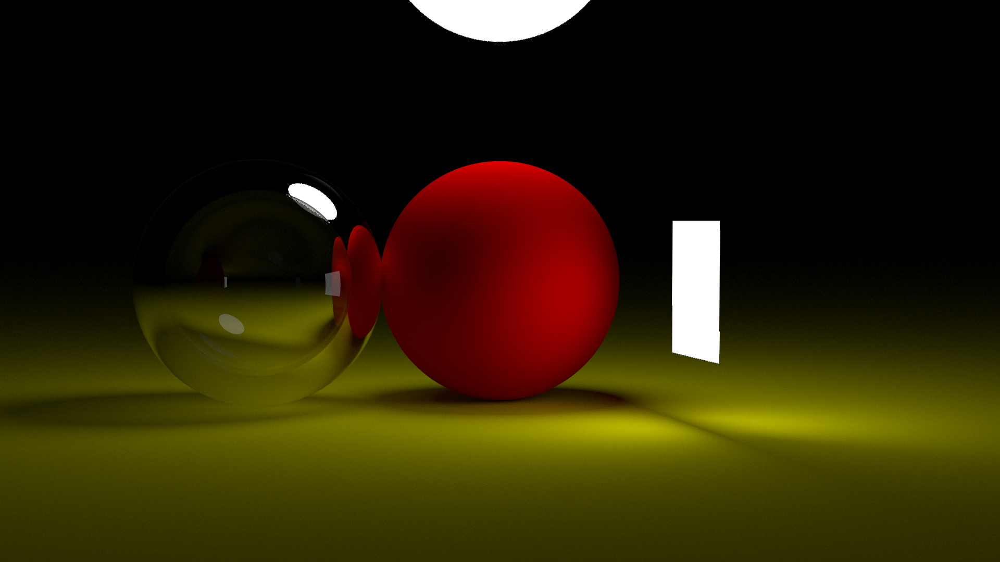

# CPU-Raytracer

<table>
	<thead>
		<tr>
			<th style="text-align:center"><a href="README.md">English</a></th>
			<th style="text-align:center">日本語</th>
		</tr>
	</thead>
</table>

## 1. はじめに
このプロジェクトは、C++で実装したCPUベースのレイトレーサです。

光の反射・屈折・影を物理的にシミュレーションし、高精細かつリアルな3Dレンダリングを実現します。

実装は[Ray Tracing in One Weekend](https://raytracing.github.io/) をベースに、独自の拡張と最適化を加えています。

---

## 2. システム内容
- GPUを使わずCPUのみのレンダリング
- 複数のマテリアル
- 光源モデルによるリアルな影の描画
- アンチエイリアス
- 高解像度レンダリング
- C/C++での実装
  
---

## 3. 動作環境
- OS: Red Hat Enterprise Linux 7.7（サーバ版）  
- カーネルバージョン: Linux 3.10.0-1062.el7.x86_64  
- アーキテクチャ: x86-64（64ビット）  
- ビルドツール: GNU Make 3.82  
- コンパイラ: g++（GCC）4.8.5

---

## 4. 使い方
1. リポジトリをローカルにクローン(コピー)する。
```bash
git clone https://github.com/Mana277/cpu-raytracer.git
```
2. ソースコードディレクトリに移動する。  
```bash
cd src
```
3. 'make'コマンドでビルドする。
```bash
make
```
4. 実行ファイル'my_app'が生成されるので実行する。(内容によってはレンダリングに時間がかかる場合がある)
```bash
./my_app
```

---

## 5. 実行例
&nbsp;
<p align="center">
  
  <br/>
  <em>Sample1 : 様々なマテリアルを持つ球体</em>
</p>
&nbsp;
<p align="center">
  
  <br/>
  <em>Sample2 : 2方向からの光源が作る陰影</em>
</p>
