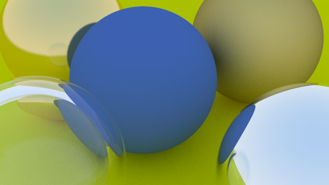

# CPU-Raytracer

## Overview

This project is a simple ray tracer that runs on the CPU.  

It is based on Peter Shirley's  ["Ray Tracing in One Weekend"](https://raytracing.github.io/books/RayTracingInOneWeekend.html).

Designed as an educational tool to learn basic ray tracing principles while allowing you to improve and extend it yourself.

## Features

- Runs on CPU only (no GPU required)  

- Supports rendering spheres  

- Anti-aliasing with configurable number of samples  

- Implemented in C++  

## Environment 

- **Operating System:** Red Hat Enterprise Linux 7.7 (Server)  
- **Kernel Version:** Linux 3.10.0-1062.el7.x86_64  
- **Architecture:** x86-64 (64-bit)  
- **Virtualization:** VMware virtual machine  
- **Build Tool:** GNU Make 3.82  
- **Compiler:** g++ (GCC) 4.8.5

## Usage

1. Open a terminal and go to the directory containing the `Makefile`.  
2. Run the command `make` to compile the project.  
3. After compilation finishes, an executable named `my_app` will be created in the same directory.  
4. Execute the program by running `./my_app`.  
5. The output image will be saved in the same directory.

## Rendered Samples

Here are examples of rendered outputs using this ray tracer:

  
   
  <em>Figure 1: Simple scene</em>

## References

- Peter Shirley, *Ray Tracing in One Weekend*, available at [https://raytracing.github.io/books/RayTracingInOneWeekend.html](https://raytracing.github.io/books/RayTracingInOneWeekend.html)

