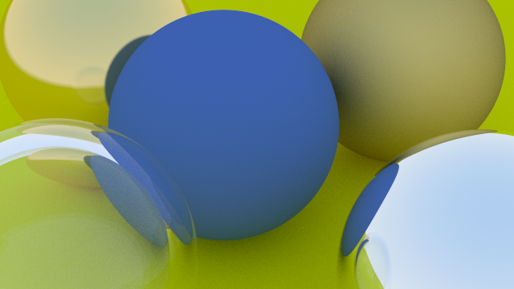
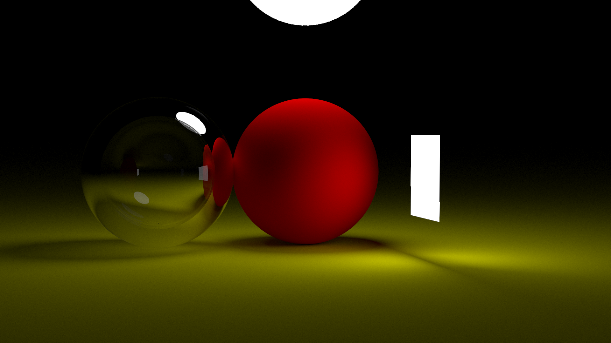

# CPU-Raytracer
<table>
	<thead>
    	<tr>
      		<th style="text-align:center">English</th>
      		<th style="text-align:center"><a href="README.ja.md">日本語</a></th>
    	</tr>
  	</thead>
</table>

## 1. Introduction
This project is a CPU-based ray tracer implemented in C++.

It physically simulates light reflection, refraction, and shadows to achieve high-resolution, photorealistic 3D rendering.

The implementation is based on [Ray Tracing in One Weekend](https://raytracing.github.io/) with original extensions and optimizations.

---

## 2. System Features
- CPU-only rendering (no GPU)
- Multiple material types
- Realistic shadows with light source models
- Anti-aliasing
- High-resolution rendering
- Implemented in C/C++

---

## 3. Environment
- OS: Red Hat Enterprise Linux 7.7 (Server Edition)  
- Kernel: Linux 3.10.0-1062.el7.x86_64  
- Architecture: x86-64 (64-bit)  
- Build Tool: GNU Make 3.82  
- Compiler: g++ (GCC) 4.8.5

---

## 4. Usage
1. Clone the repository locally:
```bash
git clone https://github.com/Mana277/cpu-raytracer.git
```
2. Move to the source directory:  
```bash
cd src
```
3. Build with 'Move':  
```bash
make
```
4. Run the generated executable my_app :(Depending on the scene, rendering may take some time.)
```bash
./my_app
```
---

## 5. Example Output
&nbsp;
<p align="center">
  
  <br/>
  <em>Sample 1: Spheres with various materials</em>
</p>
&nbsp;
<p align="center">
  
  <br/>
  <em>Sample 2: Shadows created by two light sources</em>
</p>
